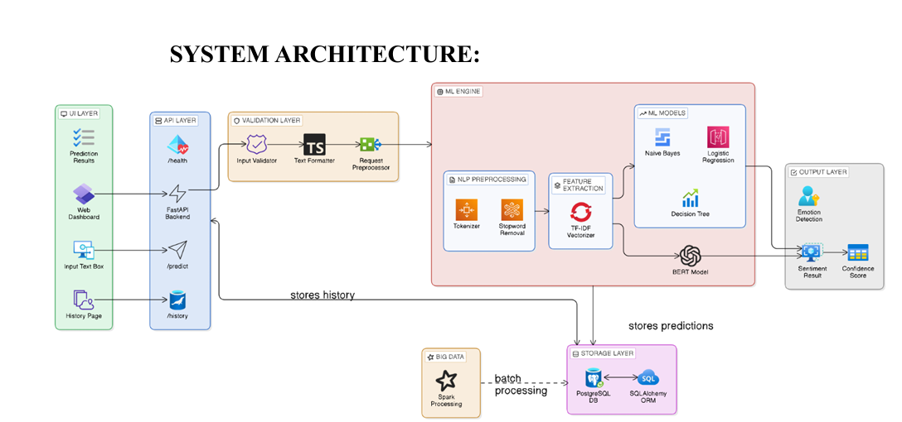
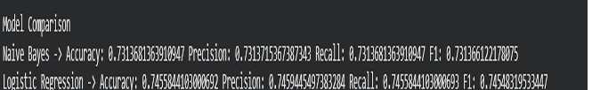
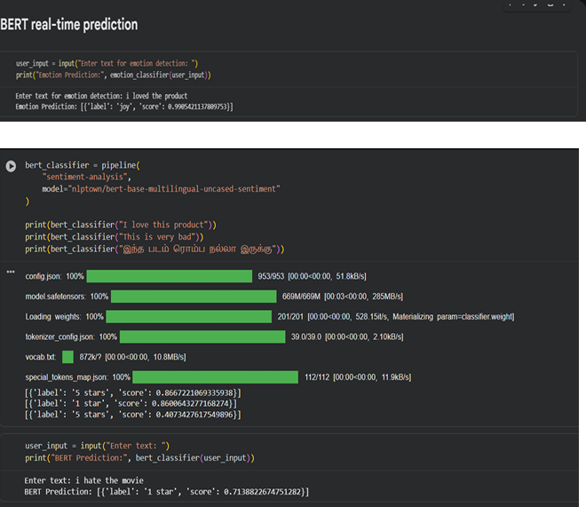
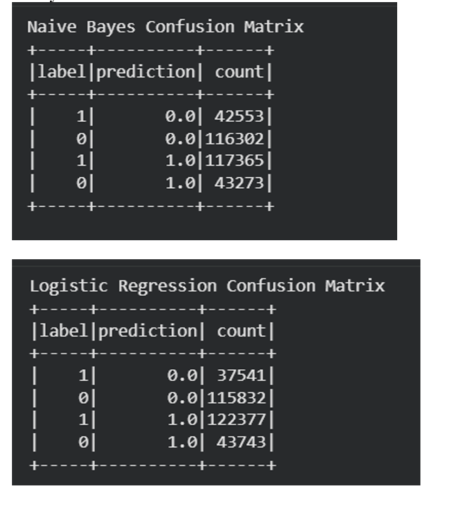
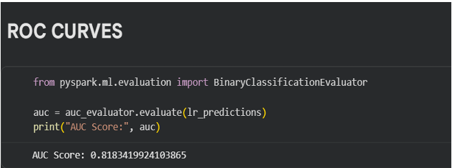

# Sentiment Analysis on Social Media Data

## Overview

This project performs sentiment analysis on social media text using Natural Language Processing (NLP), Machine Learning, and Deep Learning techniques.

The system preprocesses raw social media text, extracts meaningful features using TF-IDF, trains multiple machine learning models, and integrates a BERT model for improved contextual sentiment prediction.

---

## Features

- Text preprocessing using NLP
- Tokenization
- Stop-word removal
- Stemming
- TF-IDF Vectorization
- Sentiment Classification
- BERT-based prediction
- FastAPI backend
- PostgreSQL integration
- Apache Spark (PySpark)
- Performance Evaluation
- Visualization of Results

---

## Technologies Used

- Python
- Pandas
- NumPy
- PySpark
- Scikit-learn
- NLTK
- Transformers (BERT)
- FastAPI
- PostgreSQL
- Google Colab

---

## Machine Learning Models

- Naive Bayes
- Logistic Regression
- Decision Tree
- BERT

---

## Evaluation Metrics

- Accuracy
- Precision
- Recall
- F1-Score
- ROC-AUC
- Confusion Matrix

---

## Dataset

Sentiment140 Dataset

https://www.kaggle.com/datasets/kazanova/sentiment140

---

## Repository Structure

```

social-media-sentiment-analysis/
├── sentiment_analysis.ipynb
├── requirements.txt
├── dataset_link.txt
├── images/
└── README.md

```

---

Screenshots
---
## System Architecture



## Model Comparison



## BERT Prediction



## Confusion Matrix



## ROC Curve




## Results


Logistic Regression achieved better overall performance than Naive Bayes, while BERT significantly improved contextual sentiment understanding for real-time predictions.

---

## Future Improvements

- Live Twitter API Integration
- Multilingual Sentiment Analysis
- Emotion Detection
- Real-time Dashboard
- Cloud Deployment

---

## Author

Harini P M
